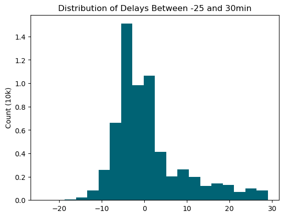
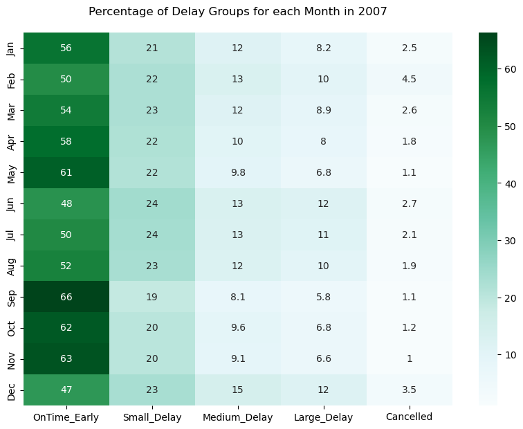
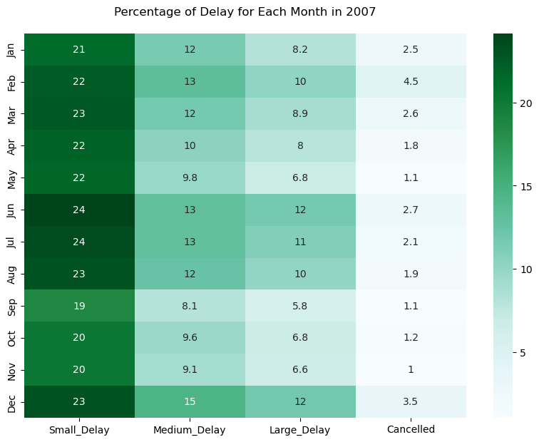
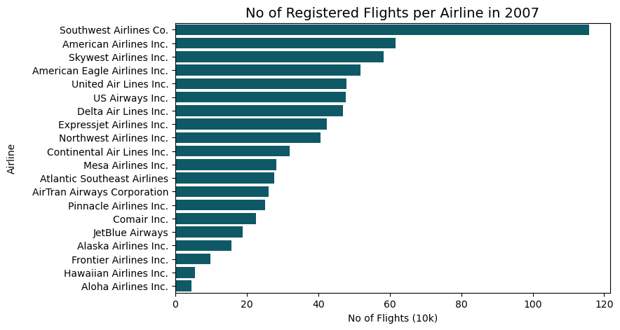

# Airline On-Time Performance Data Exploratory Analysis
## by Esosa Orumwese

## Dataset
Have you ever been stuck in an airport because your flight was delayed or cancelled and wondered if you could have predicted it if you'd had more data? This is your chance to find out. 

The complete dataset consists of flight arrival and departure details for all commercial flights within the USA, from October 1987 to April 2008. However only data for 2007 will be used for this project. This is a large dataset: there are nearly 120 million records in total, and takes up 1.6 gigabytes of space compressed and 12 gigabytes when uncompressed. The data comes originally from RITA where it is described in detail. You can download the data [here](https://dataverse.harvard.edu/dataset.xhtml?persistentId=doi:10.7910/DVN/HG7NV7).

## Summary of Findings
### Q1. Were there more delayed flights than there were early or on-time flights?
The dataset contained a lot of negative values, signifying the flights that were early.

As a result, departure delay was grouped into 4 categories;
* OnTime_Early: Delay times that were less than or equal zero,
* Small_Delay: Delay time of less than 15 minutes,
* Medium_Delay: Delay times between 15 minutes and 45 minutes,
* Large_Delay: Delay times greater than 45 minutes.

It was found that 55% of the flights in 2007 were either on-time or early with just 21.95% experiencing a small delay and 2% cancelled.

### Q2. How does the number of registered flights vary per month?
Although the median number of bookings seems to be above 600,000 in 2007, February seemed to have the least amount of flight bookings (565,604) while July and August had the most (648,544 and 653,276 respectively).

### Q3. What is the distribution of early, on-time, delayed and cancelled flights per month?
There is clear and gradual decrease in percentage of delays for each month as seen in the heatmap below. 

When looking at the distribution, neglecting the on-time and early flights, we can notice that most delays occurred between June, July, August and December while September to November had the highest percentage of on time flights. February then December saw the highest percentage of cancelled flights than all other months in 2007.

### Q4. What is the distribution of daily flight cancellations?
When plotting the log transform of the right skewed daily flight cancellations on a calendar plot, we can see basically 3 periods of increase in cancellations. From January to mid-April, then from June to August and from the last week of November to December.

### Q5. How does the number of registered flights compare amongst airlines?
Southwest Airlines Co. seems to be the most popular airline in 2007 with a total of 1,158,878 registered flights followed by 'American Airlines Inc'. and 'Skywest Airlines Inc'. both having 615,933 and 583,696 registered flights respectively. The least used airline is 'Aloha Airlines Inc.' having just 45,972 booked flights.

### Q6. What is the distribution of delays for the top airlines?
Airlines with more that 450k registered flights were classified as top airlines. Visualizing by delay group, we can notice that although Southwest Airlines had the most registered flights, it turns out that it has the least on-time or early flights (44%) out of the airlines in the 'more than 450k' group. While Delta Air Lines Inc., which comparatively had the least registered number of flights, turns out to have the most on-time or early flights with a value of 61%.

The delay groups were further grouped into 2 groups. Good delays represented the acceptable delays, covering on-time, early and small delay flights while bad delays covered the medium to Large delays and cancelled flights.

It was seen that Delta Air Lines Inc. has the least bad delays overall while, of the top airlines, American Eagles Airlines Inc has the worst delays.

## Conclusion
In 2007, just over 50% of all registered flights were either on-time or early. The remaining approximately 45% were either delayed or outright cancelled. A majority of the delays and cancellations occured from January to mid-April, then from June to August and from the last week of November to December. Southwest Airlines Co. had the most registered flights (1,158,878 flights) but when compared to the top 7 airlines, it had the least percentage of on-time/early flights. When looking at acceptable delays (inclusive of on-time/early flights and small delays), both Delta Air Lines Inc and Skywest Airlines inc had the best acceptable delays with

## Recommendations
* There are still more insights to be drawn from the complete dataset for 1987 to 2008. It is advised that tools for working with big data should be employed due to the large size of the combined data and its effect on memory.
* Further analysis should look into questions which revolve around but not limited to;
  * When is the best time of day/day of week/time of year to fly to minimise delays?
  * Do older planes suffer more delays?
  * How does the number of people flying between different locations change over time?
  * How well does weather predict plane delays?
  * Can you detect cascading failures as delays in one airport create delays in others? Are there critical links in the system?